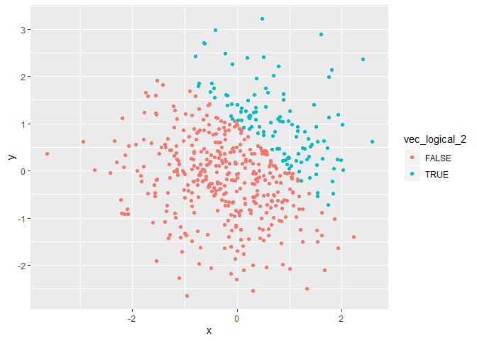

p8105\_hw1\_mss2284
================
Maya Spaur
9/13/2019

## Problem 1

``` r
library(tidyverse)
```

    ## -- Attaching packages ------------------------------------- tidyverse 1.2.1 --

    ## v ggplot2 3.2.1     v purrr   0.3.2
    ## v tibble  2.1.3     v dplyr   0.8.3
    ## v tidyr   0.8.3     v stringr 1.4.0
    ## v readr   1.3.1     v forcats 0.4.0

    ## -- Conflicts ---------------------------------------- tidyverse_conflicts() --
    ## x dplyr::filter() masks stats::filter()
    ## x dplyr::lag()    masks stats::lag()

``` r
problem1_df = tibble(
  norm_samp = rnorm(8),
  vec_logical = norm_samp > 0,
  vec_char = character(length=8),
  vec_factor = factor(c("1", "2", "3", "3", "2", "1", "1", "2")),
)

mean(pull(problem1_df, norm_samp))
```

    ## [1] -0.0901863

``` r
mean(pull(problem1_df, vec_logical))
```

    ## [1] 0.375

``` r
mean(pull(problem1_df, vec_char))
```

    ## Warning in mean.default(pull(problem1_df, vec_char)): argument is not
    ## numeric or logical: returning NA

    ## [1] NA

``` r
mean(pull(problem1_df, vec_factor))
```

    ## Warning in mean.default(pull(problem1_df, vec_factor)): argument is not
    ## numeric or logical: returning NA

    ## [1] NA

The means were able to be calculated for norm\_samp and vec\_logical,
but not for vec\_char and vec\_factor.

Converting the variables to
numeric:

``` r
as.numeric(pull(problem1_df, vec_logical))*(pull(problem1_df, norm_samp))

as.factor(pull(problem1_df, vec_logical))*(pull(problem1_df, norm_samp))

as.numeric(as.factor(pull(problem1_df, vec_logical)))*(pull(problem1_df, norm_samp))
```

As numeric was able to convert the logical variable (assigns 0 to false
and 1 to TRUE). It didn’t work for the character variable, it could not
be converted to a numeric variable. The factor variable was able to be
converted to 3 levels.

## Problem 2

``` r
problem2_df = tibble(
  x = rnorm(500),
  y = rnorm(500),
  vec_logical_2 = x + y > 1,
  as.numeric(vec_logical_2),
  as.factor(vec_logical_2),
)
```

The dataset has a number of rows500, and number of columns 5.

The mean of the variable x is 0.0169495. The median of the variable x is
0.0343334. The standard deviation of the variable x is 0.9962312.

The proportion of cases for which x + y is greater than one is
0.244.

Scatterplot

``` r
ggplot(problem2_df, aes(x = x, y = y, color = vec_logical_2)) + geom_point()
```

<!-- -->

``` r
ggsave
```

    ## function (filename, plot = last_plot(), device = NULL, path = NULL, 
    ##     scale = 1, width = NA, height = NA, units = c("in", "cm", 
    ##         "mm"), dpi = 300, limitsize = TRUE, ...) 
    ## {
    ##     dpi <- parse_dpi(dpi)
    ##     dev <- plot_dev(device, filename, dpi = dpi)
    ##     dim <- plot_dim(c(width, height), scale = scale, units = units, 
    ##         limitsize = limitsize)
    ##     if (!is.null(path)) {
    ##         filename <- file.path(path, filename)
    ##     }
    ##     old_dev <- grDevices::dev.cur()
    ##     dev(filename = filename, width = dim[1], height = dim[2], 
    ##         ...)
    ##     on.exit(utils::capture.output({
    ##         grDevices::dev.off()
    ##         if (old_dev > 1) grDevices::dev.set(old_dev)
    ##     }))
    ##     grid.draw(plot)
    ##     invisible()
    ## }
    ## <bytecode: 0x0000000011f9efb0>
    ## <environment: namespace:ggplot2>

``` r
ggplot(problem2_df, aes(x = x, y = y, color = as.numeric(problem2_df$vec_logical_2))) + geom_point()
```

<!-- -->

``` r
ggplot(problem2_df, aes(x = x, y = y, color = as.factor(problem2_df$vec_logical_2))) + geom_point()
```

<!-- -->

For the scatterplot with the as.numeric variable, the color scale is
continuous from light to dark blue to reflect the continuous variable.
For the plot using the logical variable and factor variable, there were
two colors, to represent the binary (logical) variable, blue for true
and orange for false.
