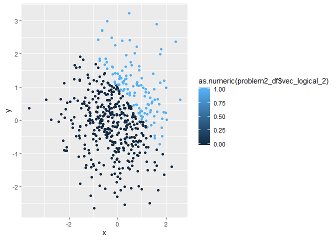

p8105\_hw1\_mss2284
================
Maya Spaur
9/13/2019

## Problem 1

``` r
library(tidyverse)
```

    ## -- Attaching packages ------------------------------------- tidyverse 1.2.1 --

    ## v ggplot2 3.2.1     v purrr   0.3.2
    ## v tibble  2.1.3     v dplyr   0.8.3
    ## v tidyr   0.8.3     v stringr 1.4.0
    ## v readr   1.3.1     v forcats 0.4.0

    ## -- Conflicts ---------------------------------------- tidyverse_conflicts() --
    ## x dplyr::filter() masks stats::filter()
    ## x dplyr::lag()    masks stats::lag()

``` r
problem1_df = tibble(
  norm_samp = rnorm(8),
  vec_logical = norm_samp > 0,
  vec_char = character(length=8),
  vec_factor = factor(c("1", "2", "3", "3", "2", "1", "1", "2")),
)

mean(problem1_df$norm_samp)
```

    ## [1] -0.2873572

``` r
mean(problem1_df$vec_logical)
```

    ## [1] 0.375

``` r
mean(problem1_df$vec_char)
```

    ## Warning in mean.default(problem1_df$vec_char): argument is not numeric or
    ## logical: returning NA

    ## [1] NA

``` r
mean(problem1_df$vec_factor)
```

    ## Warning in mean.default(problem1_df$vec_factor): argument is not numeric or
    ## logical: returning NA

    ## [1] NA

The means were able to be calculated for norm\_samp and vec\_logical,
but not for vec\_char and vec\_factor.

Converting the variables to numeric:

``` r
eval = FALSE

as.numeric(problem1_df$vec_logical)*(problem1_df$norm_samp)
```

    ## [1] 0.0000000 1.0924021 0.0000000 0.0000000 0.5393216 1.3154086 0.0000000
    ## [8] 0.0000000

``` r
as.factor(problem1_df$vec_logical)*(problem1_df$norm_samp)
```

    ## Warning in Ops.factor(as.factor(problem1_df$vec_logical),
    ## (problem1_df$norm_samp)): '*' not meaningful for factors

    ## [1] NA NA NA NA NA NA NA NA

``` r
as.numeric(as.factor(problem1_df$vec_logical))*(problem1_df$norm_samp)
```

    ## [1] -0.1772067  2.1848043 -0.7074946 -2.3884131  1.0786433  2.6308173
    ## [7] -1.2597586 -0.7131174

NOTE: check about multipying factor version of logical vector to random
sample

## Problem 2

``` r
problem2_df = tibble(
  x = rnorm(500),
  y = rnorm(500),
  vec_logical_2 = x + y > 1,
  vector_sum = x + y,
  )

as.numeric(problem2_df$vec_logical_2)
```

    ##   [1] 0 0 1 0 0 0 0 0 0 0 1 0 0 0 0 0 1 0 0 0 1 1 0 1 0 0 1 1 0 1 0 0 0 0 0
    ##  [36] 0 0 1 1 0 0 1 0 0 0 0 0 0 0 0 0 0 0 0 0 0 0 1 0 0 0 1 0 0 0 0 0 1 0 0
    ##  [71] 0 1 1 0 1 0 0 0 0 0 0 1 1 0 0 0 0 1 1 0 0 0 0 1 0 1 0 0 0 0 0 1 0 0 0
    ## [106] 0 0 0 0 0 0 0 1 0 0 0 0 0 1 1 0 0 0 0 0 0 0 0 1 0 1 1 0 0 0 1 0 0 1 0
    ## [141] 1 0 1 0 0 1 1 0 0 0 1 0 0 0 1 1 0 0 0 0 0 0 0 0 0 0 1 0 0 1 0 1 0 1 0
    ## [176] 0 0 0 0 1 0 0 0 0 0 1 0 0 0 0 0 0 0 1 0 1 0 1 0 1 1 1 0 0 0 0 0 0 0 0
    ## [211] 0 1 0 0 0 0 0 0 0 0 0 1 0 1 0 0 0 0 1 0 0 0 0 0 1 1 0 0 0 0 0 0 0 1 1
    ## [246] 0 0 0 0 0 0 0 1 0 0 0 0 0 0 0 1 0 0 1 0 0 1 1 0 0 0 1 0 1 0 0 0 0 0 0
    ## [281] 0 0 0 0 1 0 1 0 1 0 0 0 1 0 1 1 1 0 0 0 0 0 0 0 0 0 1 0 0 0 0 0 1 0 0
    ## [316] 0 0 0 0 0 0 0 0 0 0 0 0 0 1 1 1 0 0 0 0 0 1 0 0 0 0 0 0 0 0 1 1 0 1 1
    ## [351] 1 1 1 1 0 0 0 1 0 1 0 0 0 0 0 1 0 0 1 0 1 0 0 0 0 0 0 0 1 0 0 0 0 0 1
    ## [386] 0 1 0 0 0 0 0 0 1 0 1 0 1 1 0 0 0 1 0 0 0 0 0 0 1 0 0 1 0 0 0 1 1 0 0
    ## [421] 0 0 0 1 0 0 0 0 0 0 0 0 0 0 0 0 0 0 0 0 0 1 1 0 0 0 0 0 1 0 1 0 0 1 1
    ## [456] 0 0 0 0 0 1 0 0 1 0 0 0 0 0 0 0 0 0 0 0 0 0 0 0 0 0 0 1 0 1 0 0 0 0 0
    ## [491] 0 0 0 1 1 1 1 0 0 1

``` r
as.factor(problem2_df$vec_logical_2)
```

    ##   [1] FALSE FALSE TRUE  FALSE FALSE FALSE FALSE FALSE FALSE FALSE TRUE 
    ##  [12] FALSE FALSE FALSE FALSE FALSE TRUE  FALSE FALSE FALSE TRUE  TRUE 
    ##  [23] FALSE TRUE  FALSE FALSE TRUE  TRUE  FALSE TRUE  FALSE FALSE FALSE
    ##  [34] FALSE FALSE FALSE FALSE TRUE  TRUE  FALSE FALSE TRUE  FALSE FALSE
    ##  [45] FALSE FALSE FALSE FALSE FALSE FALSE FALSE FALSE FALSE FALSE FALSE
    ##  [56] FALSE FALSE TRUE  FALSE FALSE FALSE TRUE  FALSE FALSE FALSE FALSE
    ##  [67] FALSE TRUE  FALSE FALSE FALSE TRUE  TRUE  FALSE TRUE  FALSE FALSE
    ##  [78] FALSE FALSE FALSE FALSE TRUE  TRUE  FALSE FALSE FALSE FALSE TRUE 
    ##  [89] TRUE  FALSE FALSE FALSE FALSE TRUE  FALSE TRUE  FALSE FALSE FALSE
    ## [100] FALSE FALSE TRUE  FALSE FALSE FALSE FALSE FALSE FALSE FALSE FALSE
    ## [111] FALSE FALSE TRUE  FALSE FALSE FALSE FALSE FALSE TRUE  TRUE  FALSE
    ## [122] FALSE FALSE FALSE FALSE FALSE FALSE FALSE TRUE  FALSE TRUE  TRUE 
    ## [133] FALSE FALSE FALSE TRUE  FALSE FALSE TRUE  FALSE TRUE  FALSE TRUE 
    ## [144] FALSE FALSE TRUE  TRUE  FALSE FALSE FALSE TRUE  FALSE FALSE FALSE
    ## [155] TRUE  TRUE  FALSE FALSE FALSE FALSE FALSE FALSE FALSE FALSE FALSE
    ## [166] FALSE TRUE  FALSE FALSE TRUE  FALSE TRUE  FALSE TRUE  FALSE FALSE
    ## [177] FALSE FALSE FALSE TRUE  FALSE FALSE FALSE FALSE FALSE TRUE  FALSE
    ## [188] FALSE FALSE FALSE FALSE FALSE FALSE TRUE  FALSE TRUE  FALSE TRUE 
    ## [199] FALSE TRUE  TRUE  TRUE  FALSE FALSE FALSE FALSE FALSE FALSE FALSE
    ## [210] FALSE FALSE TRUE  FALSE FALSE FALSE FALSE FALSE FALSE FALSE FALSE
    ## [221] FALSE TRUE  FALSE TRUE  FALSE FALSE FALSE FALSE TRUE  FALSE FALSE
    ## [232] FALSE FALSE FALSE TRUE  TRUE  FALSE FALSE FALSE FALSE FALSE FALSE
    ## [243] FALSE TRUE  TRUE  FALSE FALSE FALSE FALSE FALSE FALSE FALSE TRUE 
    ## [254] FALSE FALSE FALSE FALSE FALSE FALSE FALSE TRUE  FALSE FALSE TRUE 
    ## [265] FALSE FALSE TRUE  TRUE  FALSE FALSE FALSE TRUE  FALSE TRUE  FALSE
    ## [276] FALSE FALSE FALSE FALSE FALSE FALSE FALSE FALSE FALSE TRUE  FALSE
    ## [287] TRUE  FALSE TRUE  FALSE FALSE FALSE TRUE  FALSE TRUE  TRUE  TRUE 
    ## [298] FALSE FALSE FALSE FALSE FALSE FALSE FALSE FALSE FALSE TRUE  FALSE
    ## [309] FALSE FALSE FALSE FALSE TRUE  FALSE FALSE FALSE FALSE FALSE FALSE
    ## [320] FALSE FALSE FALSE FALSE FALSE FALSE FALSE FALSE FALSE TRUE  TRUE 
    ## [331] TRUE  FALSE FALSE FALSE FALSE FALSE TRUE  FALSE FALSE FALSE FALSE
    ## [342] FALSE FALSE FALSE FALSE TRUE  TRUE  FALSE TRUE  TRUE  TRUE  TRUE 
    ## [353] TRUE  TRUE  FALSE FALSE FALSE TRUE  FALSE TRUE  FALSE FALSE FALSE
    ## [364] FALSE FALSE TRUE  FALSE FALSE TRUE  FALSE TRUE  FALSE FALSE FALSE
    ## [375] FALSE FALSE FALSE FALSE TRUE  FALSE FALSE FALSE FALSE FALSE TRUE 
    ## [386] FALSE TRUE  FALSE FALSE FALSE FALSE FALSE FALSE TRUE  FALSE TRUE 
    ## [397] FALSE TRUE  TRUE  FALSE FALSE FALSE TRUE  FALSE FALSE FALSE FALSE
    ## [408] FALSE FALSE TRUE  FALSE FALSE TRUE  FALSE FALSE FALSE TRUE  TRUE 
    ## [419] FALSE FALSE FALSE FALSE FALSE TRUE  FALSE FALSE FALSE FALSE FALSE
    ## [430] FALSE FALSE FALSE FALSE FALSE FALSE FALSE FALSE FALSE FALSE FALSE
    ## [441] FALSE TRUE  TRUE  FALSE FALSE FALSE FALSE FALSE TRUE  FALSE TRUE 
    ## [452] FALSE FALSE TRUE  TRUE  FALSE FALSE FALSE FALSE FALSE TRUE  FALSE
    ## [463] FALSE TRUE  FALSE FALSE FALSE FALSE FALSE FALSE FALSE FALSE FALSE
    ## [474] FALSE FALSE FALSE FALSE FALSE FALSE FALSE FALSE FALSE TRUE  FALSE
    ## [485] TRUE  FALSE FALSE FALSE FALSE FALSE FALSE FALSE FALSE TRUE  TRUE 
    ## [496] TRUE  TRUE  FALSE FALSE TRUE 
    ## Levels: FALSE TRUE

\*The dataset has a number of rows500, and number of columns 4.

The mean of the variable x is 0.0108367. The median of the variable x is
-0.0037777. The standard deviation of the variable x is 0.9757989.

The proportion of cases for which x + y is greater than one is
0.9002683.

Scatterplot

``` r
ggplot(problem2_df, aes(x = x, y = y, color = vec_logical_2)) + geom_point()
```

<!-- -->

``` r
ggsave
```

    ## function (filename, plot = last_plot(), device = NULL, path = NULL, 
    ##     scale = 1, width = NA, height = NA, units = c("in", "cm", 
    ##         "mm"), dpi = 300, limitsize = TRUE, ...) 
    ## {
    ##     dpi <- parse_dpi(dpi)
    ##     dev <- plot_dev(device, filename, dpi = dpi)
    ##     dim <- plot_dim(c(width, height), scale = scale, units = units, 
    ##         limitsize = limitsize)
    ##     if (!is.null(path)) {
    ##         filename <- file.path(path, filename)
    ##     }
    ##     old_dev <- grDevices::dev.cur()
    ##     dev(filename = filename, width = dim[1], height = dim[2], 
    ##         ...)
    ##     on.exit(utils::capture.output({
    ##         grDevices::dev.off()
    ##         if (old_dev > 1) grDevices::dev.set(old_dev)
    ##     }))
    ##     grid.draw(plot)
    ##     invisible()
    ## }
    ## <bytecode: 0x00000000158ee458>
    ## <environment: namespace:ggplot2>

``` r
ggplot(problem2_df, aes(x = x, y = y, color = as.numeric(problem2_df$vec_logical_2))) + geom_point()
```

<!-- -->

``` r
ggplot(problem2_df, aes(x = x, y = y, color = as.factor(problem2_df$vec_logical_2))) + geom_point()
```

<!-- -->

For the scatterplot with the as.numeric variable, the color scale is
continuous from light to dark blue to reflect the continuous variable.
For the plot using the logical variable and factor variable, there were
two colors, to represent the binary (logical) variable, blue for true
and orange for false.
